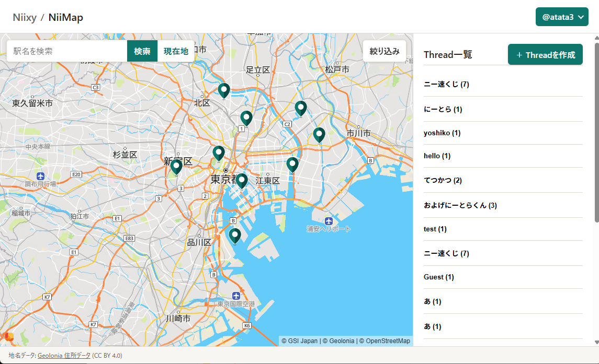

# Niixy

## 概要
Niixyは下記2点を主要機能として想定する、開発中のSNSです。

1. ユーザーが地図上に情報を配置し、他のユーザーが必要な情報を抽出できる。
2. ユーザーが情報のフィールド、検索条件、表示方法などを拡張できる。

現在のv0.4.1では、地図上でのThreadの作成・閲覧・返信、アカウント機能、プロフィール上での投稿履歴の閲覧までを実装しています。

## スクリーンショット

## デモ

[公開版URL](https://niixy-psi.vercel.app/)

## 技術構成

- Backend: Python / Django
- Frontend: HTML / CSS / JavaScript
- Database: Neon (PostgreSQL)
- Map: Leaflet
- Deployment: Vercel

## 開発体制

実装にはCodexを利用しており、現時点では、実装コードや構造を自力で説明・修正できる段階にはありません。
開発者としては要件定義、画面設計、受け入れテスト、改善判断を担当しています。
将来的にはコードを段階的に読み解き、使用技術と実装への理解を深める予定ですが、
現在はプロトタイプとして全体像を検証することを優先し、機能開発を先行させています。

## 開発履歴（概要）

- **v0.1**：地図上でのEvent投稿・検索
- **v0.2**：アカウント機能と投稿管理
- **v0.3**：Event中心からThread中心の構成へ移行
- **v0.4**：公開ProfileとThread履歴
- **v0.4.1**：Profileのオンデマンド化／MyPageとResponse履歴

## 開発背景

訓練校でプログラミングを学んでいた頃、新しいSNSが公開されたことをきっかけに、自分が利用したいSNSを構想しました。
当時は、ユーザーを集める難しさから開発には踏み切りませんでしたが、Codexを活用した個人開発を実践する題材として、改めて開発を始めました。

構想の軸としたのは以下の2点です。

1. イベントや地域の告知に始まり、求人、店舗、人同士のマッチングなどを含む、さまざまな情報を地図上へ投稿し、場所を起点に検索できるサービスがあれば便利だと考えました。

2. 情報やネットコミュニティがさまざまなサービスに分散し、横断的に探しづらくなっている理由の一つに、それぞれが必要とするフィールド、検索条件、表示方法、機能の違いがあるのではないかと考えました。そこで、それらを用途に応じて拡張し、一つのサービスで扱える仕組みを構想しました。

ユーザーや投稿が少ない段階でもサービスを体験しやすいよう、以下も設計方針としています。

- アカウントを作成しなくても主要機能を利用できること
- スマートフォンでの利用を前提とし、PCでは画面の広さを活かせること
- 投稿の基本単位を、気軽に投稿・返信しやすいThreadとすること