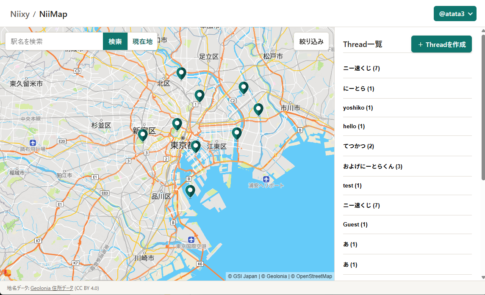

# Niixy

## 概要
Niixyは、以下の2点を主要機能として想定して開発しているSNSです。

1. ユーザーが地図上に情報を配置し、他のユーザーが必要な情報を抽出できる。
2. ユーザーが情報のフィールド、検索条件、表示方法などを拡張できる。

現在の公開版では、地図上でのThreadとRoomの作成・閲覧、Threadへの返信、Roomへの参加、Room内での複数Boardの作成・編集・削除とThread作成、アカウント機能、プロフィール上での投稿履歴の閲覧までを実装しています。

## 開発体制

実装にはCodexを利用しており、現時点では、実装コードや構造を自力で説明・修正できる段階にはありません。
開発者としては要件定義、画面設計、受け入れテスト、改善判断を担当しています。
将来的にはコードを段階的に読み解き、使用技術と実装への理解を深める予定ですが、
現在は全体像を検証することを優先し、機能開発を先行させています。

## デモ

**公開版**

[Niixyの公開版を開く](https://niixy-psi.vercel.app/)

**スクリーンショット**

## 実装環境

- Backend: Python / Django
- Frontend: HTML / CSS / JavaScript
- Database: Neon (PostgreSQL)
- Map: Geolonia Maps (Embed API / MapLibre GL JS)
- Deployment: Vercel

## 構想と設計方針

構想の軸としたのは以下の2点です。

1. イベントや地域の告知に始まり、求人、店舗、人同士のマッチングなどを含むさまざまな情報を、ユーザーが気軽に地図上へ投稿し、場所を起点に検索できるサービスがあれば便利だと考えました。気軽に情報を投稿してもらう上で、情報の乱立を問題にさせない仕組みが必要だと考え、用途に応じた情報の検索精度が重要だと考えました。

2. 情報の構造については、開発者判断によって固定構造を強いるのではなく、ユーザー判断によってフィールド・表示方法・機能の拡張を可能とすることで、多様な情報を一つのサービス上で横断的に扱えるようにしたいと考えました。

サービスを体験しやすいよう、以下も設計方針としています。

- アカウントを作成しなくても主要機能を利用できること
- スマートフォンでの利用を前提とし、PCでは画面の広さを活かせること
- 投稿の基本単位を、気軽に投稿・返信しやすいThreadとすること
